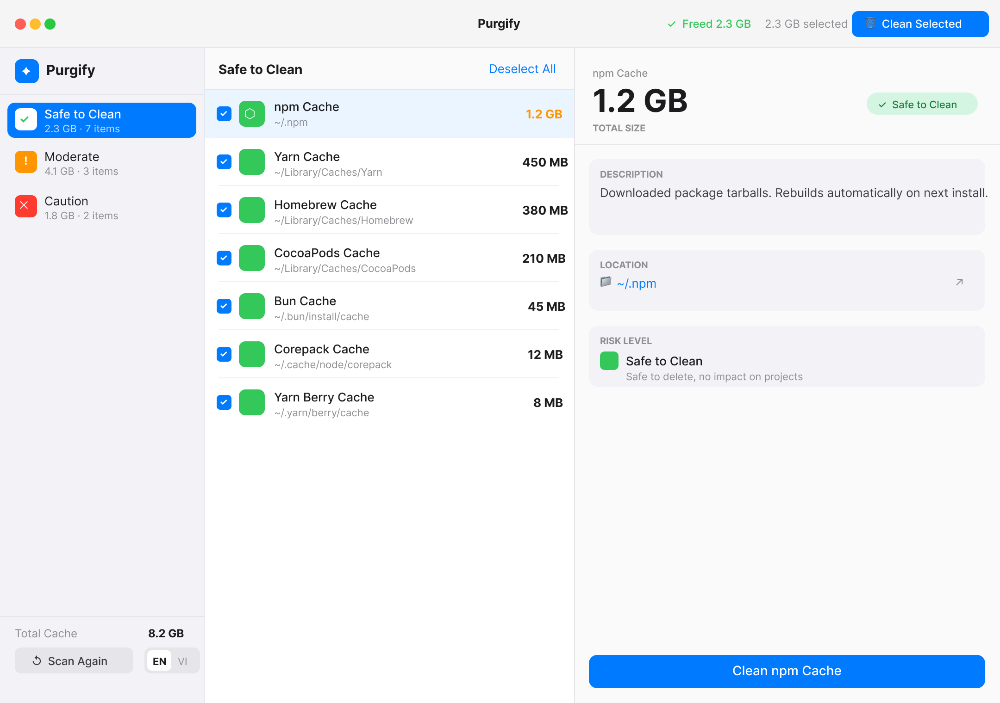
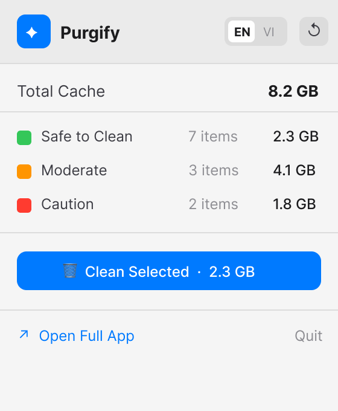
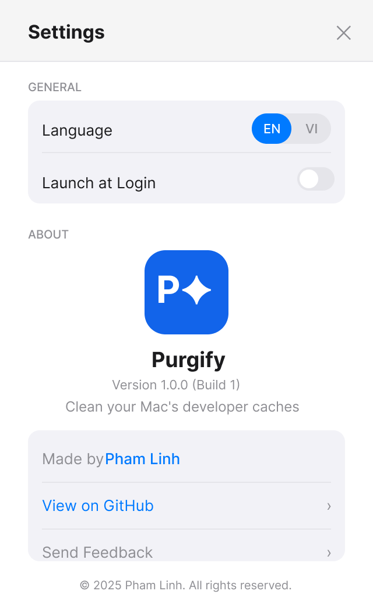

# Purgify

A lightweight macOS menu bar app that scans and cleans developer caches to free up disk space.

<p align="center">
  
</p>

## Features

- Scans **22 cache types** (npm, Yarn, pnpm, Bun, CocoaPods, Xcode DerivedData, Gradle, Docker, Cargo, pip, Flutter, Go, and more)
- Risk-based categorization: **Safe**, **Moderate**, **Caution**
- Selective cleaning — choose exactly what to delete
- Menu bar quick view + full window app
- Vietnamese & English language support
- Dark Mode support

<p align="center">
  
  &nbsp;&nbsp;
  
</p>

## Install

### Download (recommended)

1. Download the latest DMG from [Releases](https://github.com/linhh-phv/purgify/releases/latest)
2. Open the DMG and drag **Purgify** to Applications
3. First launch: right-click the app → **Open** (to bypass Gatekeeper)

### Build from source

Requires macOS 14.0+ and Xcode 15+.

```bash
git clone https://github.com/linhh-phv/purgify.git
cd purgify
open Purgify/Purgify.xcodeproj
```

Select **My Mac** as the build target → **Cmd+R** to build and run.

> **Note:** Disable **App Sandbox** in Signing & Capabilities for full file system access.

## Usage

1. Click the **Purgify** icon in the menu bar to see detected caches
2. Click **Open Full App** for the detailed 3-column view
3. Select caches by risk level, review details, and clean selectively

## License

MIT
