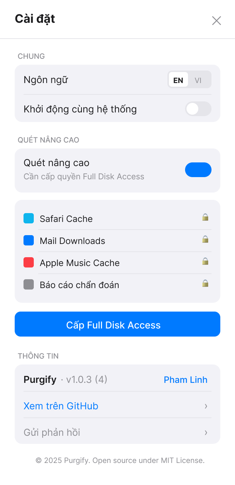

# Purgify

A lightweight macOS menu bar app that scans and cleans caches across your Mac — developer tools, browsers, apps, and system — to free up disk space.

<p align="center">
  
</p>

## Features

- Scans **68 cache types** across categories — no permission prompts required by default:
  - **Developer tools** — npm, Yarn, pnpm, Bun, CocoaPods, Xcode DerivedData, SwiftUI Previews, Gradle, Maven, Docker, Cargo, pip, Poetry, Flutter, Go, Terraform, nvm, and more
  - **Browsers** — Chrome, Arc, Firefox, Brave, Edge, Vivaldi, Opera, DuckDuckGo
  - **Media apps** — Spotify, VLC, IINA, Plex
  - **Communication** — Slack, MS Teams, Discord, Zoom, Telegram
  - **Creative** — Adobe Media Cache, Sketch
  - **IDEs & editors** — JetBrains, VS Code, Cursor, Zed, Sublime Text
  - **Productivity** — Raycast, Notion, Obsidian
  - **Games** — Steam
  - **System** — QuickLook, App Store, User Logs, iOS/watchOS/tvOS/visionOS Device Support
- **Advanced scanning** (optional) — unlocks Safari, Mail Downloads, Apple Music, and Diagnostic Reports with Full Disk Access
- Risk-based categorization: **Safe**, **Moderate**, **Caution**
- Selective cleaning — choose exactly what to delete
- Menu bar quick view + full window app
- Vietnamese & English language support
- Dark Mode support

<p align="center">
  
  &nbsp;&nbsp;
  
</p>

## Requirements

- macOS 13 Ventura or later
- Apple Silicon or Intel Mac

## Build from Source

```bash
git clone https://github.com/linhh-phv/purgify.git
cd purgify/Purgify
open Purgify.xcodeproj
```

Build and run with **⌘R** in Xcode. No external dependencies required.

## Usage

1. Click the **Purgify** icon in the menu bar to see detected caches
2. Click **Open Full App** for the detailed 3-column view
3. Select caches by risk level, review details, and clean selectively
4. Optionally enable **Advanced Scanning** in Settings to unlock 4 additional protected caches

## Architecture

```
Purgify/Purgify/
├── PurgifyApp.swift
├── Models/          (CacheItem, RiskLevel, CacheDefinitions)
├── ViewModels/      (CacheScannerViewModel)
├── Services/        (CacheScanService)
├── Managers/        (LocalizationManager)
├── Utilities/       (ByteFormatter, Color+Brand)
└── Views/
    ├── Components/  (CleanSuccessView, LanguageToggle, PostCleanBanner)
    ├── MainWindow/  (MainWindowView, SidebarView, ContentListView, ContentRowView,
    │                 DetailPanelView, SubItemsDetailView, EmptyStateView, ScanningView)
    ├── MenuBar/     (MenuBarView)
    └── Settings/    (SettingsView, FDAGuideView)
```

- **Pattern**: MVVM
- **Layout**: 3-column (Sidebar 220px | Content List 400px | Detail Panel 460px)
- **Localization**: All strings in `LocalizationManager.swift` — EN + VI

## Contributing

Pull requests are welcome. For major changes, open an issue first to discuss what you'd like to change.

1. Fork the repo
2. Create a feature branch (`git checkout -b feature/my-feature`)
3. Commit your changes
4. Open a pull request

## License

MIT License — see [LICENSE](LICENSE) for details.

Made with ♥ by [Pham Linh](https://github.com/linhh-phv)
